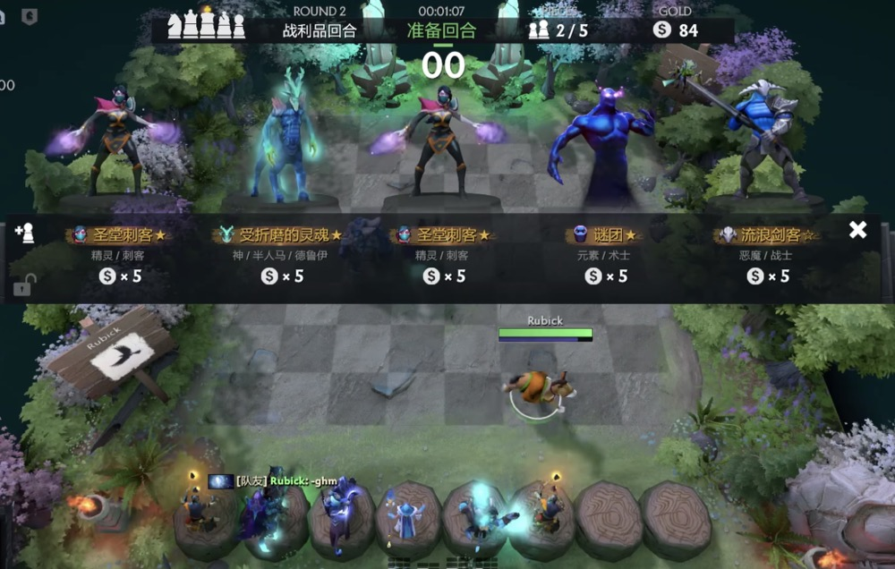

# 刀塔自走棋单人自嗨版(作弊指令) - 3 月 2 版本

English Version: [Dota2 Autochess with Cheat Commands](README_ENG.md)

## 演示视频

https://www.bilibili.com/video/BV1es4y157zM/

## 环境

- Windows 10
- Mac 应该会有问题，但估计没啥人用 mac 玩吧...

## 使用方法

1. 下载并解压获得 VPK 文件 => 1613886175.vpk
2. 找到自走棋安装目录，应该都是 'steam/steamapps/workshop/content/570/1613886175'. 如果里面用一个`publish_data`的文件里面写着`title: DOTA AUTO CHESS`，那就是对的。
3. 将里面的 1613886175.vpk 随便重命名留个档，然后把刚刚下载的 1613886175.vpk 放进去。
4. 进入 Dota2 => 刀塔自走棋 => 创建自定义房间 => 服务器地点选本地主机
5. 享受游戏吧

## 作弊指令

| 指令         | 描述                               |
| ------------ | ---------------------------------- |
| -infgold     | 每次购买棋子会将金钱变为 80        |
| -infitems    | 使用金核，黑核，经验书不会消耗次数 |
| -uninfgold   | 关闭金钱作弊                       |
| -uninfitems  | 关闭物品作弊                       |
| -jinhe       | 获得金核                           |
| -heihe       | 获得黑核                           |
| -jingyan     | 获得经验书                         |
| -infpandas   | 熊猫人钓率变为 100%                |
| -uninfpandas | 关闭熊猫人钓率作弊                 |
| -treasure1   | 获得 1 级装备宝箱                  |
| -treasure2   | 获得 2 级装备宝箱                  |
| -treasure3   | 获得 3 级装备宝箱                  |
| -treasure4   | 获得 4 级装备宝箱                  |
| -treasure5   | 获得 5 级装备宝箱                  |
| -shengwu     | 获得圣物箱                         |

## 一些问题

### 会不会影响正常模式?

不会，这个作弊只会在本地主机模式下生效，不会连接到官方服务器。但是替换文件后，不能进行联网游戏，如果想正常玩的话，就把之前留档的 1613886175.vpk 放回去。

### 官方更新了怎么办?

不知道更新的运行逻辑是什么，可能会把这个文件覆盖掉。如果覆盖了，再次下载并替换应该没问题，但是会是旧版本(3 月 2 日)的内容，可能需要我有时间再更新。我会在这里注明更新日期。
